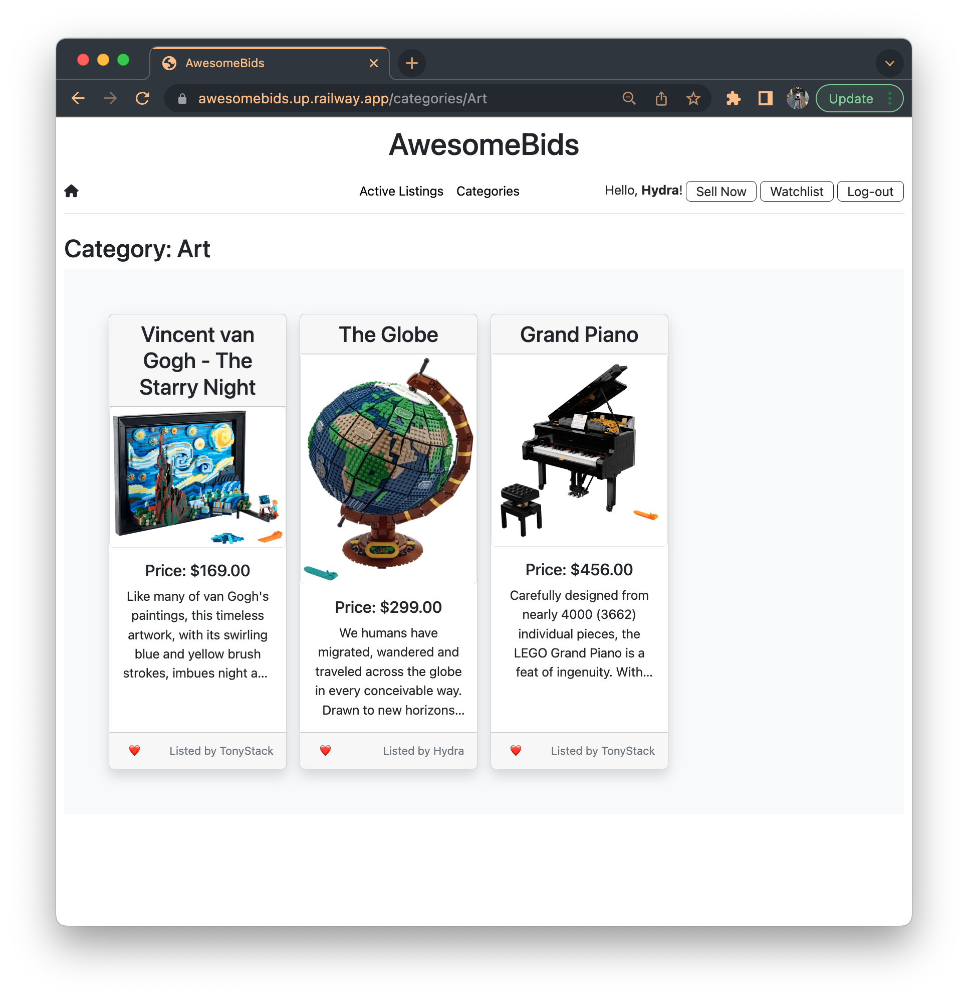

# AwesomeBids

This is my course project for CS50's Web Programming with Python and JavaScript, where I have implemented an e-commerce auction site resembling eBay. The platform enables users to create auction listings, bid on them, leave comments, and add listings to a watchlist.

**:computer: View Course [here](https://www.edx.org/course/cs50s-web-programming-with-python-and-javascript)**

**:arrow_forward: View Live Site [here](https://awesomebids.up.railway.app/)**

<!-- **:arrow_forward: View Live Demo [here]()** -->

&nbsp;

<!-- TABLE OF CONTENTS -->

  
 Table of Contents

  <ol>
    <li>
      <a href="#about-the-project">About The Project</a>
    </li>
    <li>
      <a href="#getting-started">Getting Started</a>
    </li>
    <li><a href="#round_pushpin-main-features">Main Features</a></li>
    <li><a href="#open_file_folder-project-structure">Project Structure</a></li>
    <li><a href="#acknowledgments">Acknowledgments</a></li>
  </ol>

&nbsp;

## About the Project

AwesomeBids is an e-commerce auction platform similar to eBay that allows users to create and bid on listings, leave comments, and add listings to a watchlist. The project was developed using the Django web framework and Bootstrap for front-end design. Django offers a secure and stable environment for web application development, while Bootstrap simplifies the creation of visually appealing and responsive pages. The project demonstrates my proficiency in web development concepts such as database management, user authentication, and front-end design principles.

##### Built With

- Django
- Bootstrap

&nbsp;

<!-- GETTING STARTED -->

## Getting Started

##### Requirements

- Python3
- Django

##### Run

1. Install require packages
   `pip3 install -r requirements.txt`

2. Clone project to your computer
   `git clone https://github.com/savannah-shuhua/project.git`

3. Navigate to the project directory, migrate project and run the server
   `python3 manage.py migrate && python3 manage.py runserver`

&nbsp;

<!-- MAIN FEATURES -->

## :round_pushpin: Main Features

- **Index Page**

  - **Active Listings**: The default page of the web application allows users to view all of the currently active auction listings.
  - **Listing Cards**: Each active listing will be presented as a card that includes the title, description, current price, and photo. Users can access a page dedicated to a specific listing by clicking on the listing card. Additionally, users can add or remove a listing from their watchlist by clicking on the heart icon located on the bottom left corner of the listing card.
  

       
      
  

   

- **Listing Page** Users are able to view all details about the listing, including the current price for the listing.

  - **Add to / Remove from Watchlist**: If a user is logged in, they have the ability to add an item to their personal "Watchlist." If the item is already present on the watchlist, the user has the option to remove it.
  - **Make a Bid**: A logged-in user has the capability to place a bid on an item, but the bid must be at least as high as the starting bid, and greater than any previous bids that have been made (if any) or else the user will receive an error message.
  - **Leave Comments**: Users who are logged in can leave comments on the listing page, and all comments that have been made on the listing will be visible on the listing page.
  - **Close Auction**: If a user is logged in and is the creator of the listing, they have the option to "close" the auction from the listing page, which declares the highest bidder as the winner of the auction and deactivates the listing.
  - **Winner Notification**: If a user is logged in and visits a closed listing page, and they have won the auction, they will be notified on the page.
  

     
    
    
  

   

- **Watchlist Page**

  - If a user is logged in, they can access a Watchlist page that lists all the listings that they have saved to their watchlist. By clicking on any of those listings, the user will be directed to the specific listing page.
  

     
  

- **Categories Page**
  - Users can navigate to a page that lists all of the available listing categories. Clicking on a specific category will direct the user to a page that shows all active listings within that category.
  

     
    
  

&nbsp;

<!-- PROJECT STRUCTURE -->

## :open_file_folder: Project Structure

- `./commerce/` : project file, contains all the configuration files of the project

  - `setting.py`: main setting file, used for adding all applications and middleware applications
  - `.env`: contains all the environment variables
  - `urls.py`: contains all the endpoints, naming endpoints for admin and the auctions app

- `./auctions/` : main app

  - `static/auctions/`: contains all the images, CSS
  - `templates/auctions/`: contains the HTML files
  - `admin.py`: used for registering the models into the Django administration
  - `apps.py`: app configuration
  - `forms.py`: contains all the forms
  - `models.py`: represents the models of web applications in the form of classes
  - `urls.py`: contains all the endpoints for the website
  - `views.py`: contains all the views in the form of classes

- `manage.py`: a command-line utility to run commands like `runserver`, `makemigrations`, and `migrate`
- `./screenshots/` : all the screenshots to illustrate the features of the application
- `Procfile` & `runtime.txt` & `staticfiles/`: files required for deploying the app on Railway

&nbsp;

<!-- ACKNOWLEDGMENTS -->

## Acknowledgments

- [GitHub Emoji Cheat Sheet](https://www.webpagefx.com/tools/emoji-cheat-sheet)
- [Font Awesome](https://fontawesome.com)
- [Google Font](https://fonts.google.com/)
- [Railway](https://railway.app/)
